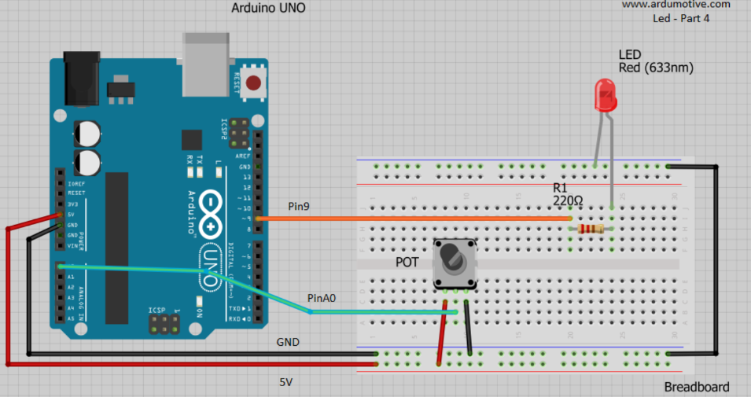
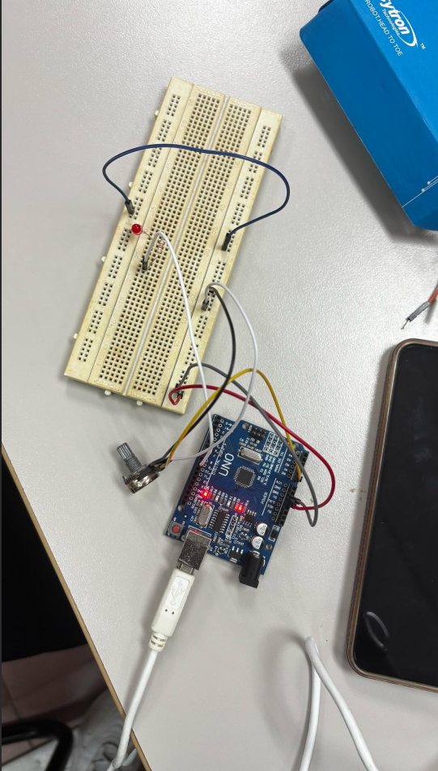
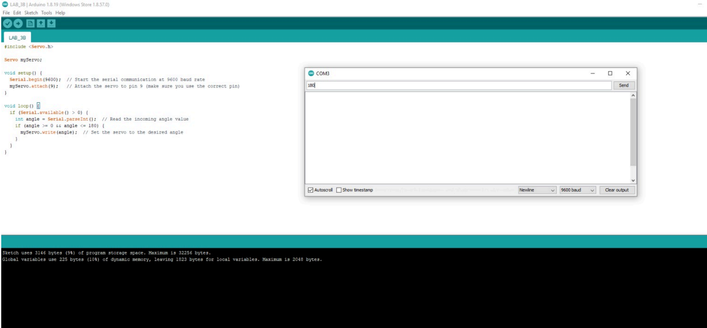
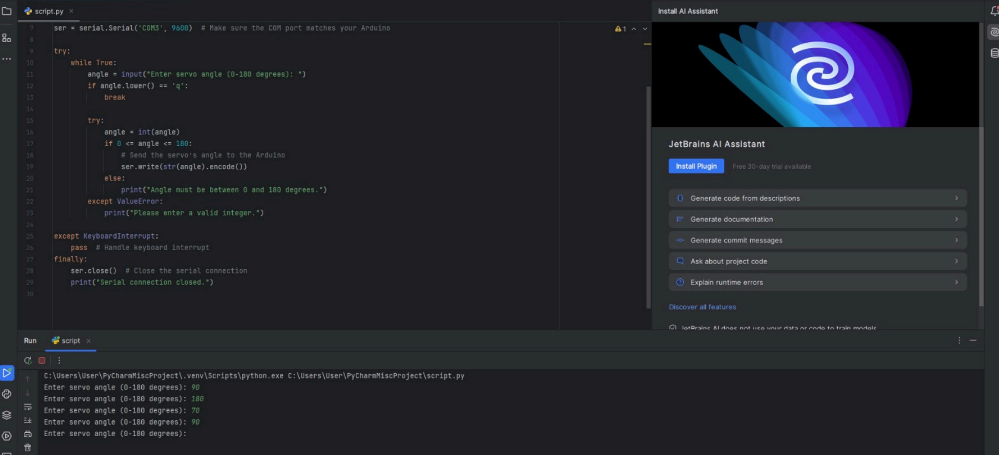

# Serial Communication: Python-Arduino Interface (Lab 2)

## Circuit Layout

### Given Layout
<p align="center">
  
  
</p>

### Actual Setup
<p align="center">
  
</p>

---

## Abstract
This project establishes a serial communication link between Python and Arduino. It enables real-time data acquisition from a potentiometer and remote control of a servo motor using Python input.

---

## Introduction
This experiment uses the PySerial library to connect Arduino (hardware) with Python (software). Serial communication allows reliable data transfer with minimal interference, making it suitable for embedded systems and automation.

---

## Equipment
- Arduino Uno  
- Servo Motor (MG995 / SG90)  
- 10k Ohm Potentiometer  
- Python 3.x (PySerial)  
- Arduino IDE  

---

## Methodology

### 3A: Data Stream
- Arduino reads analog values (0–1023) from potentiometer  
- Data sent via Serial (9600 baud rate)  
- Python reads and displays values in real-time  

### 3B: Hardware Control
- User inputs angle (0–180) in Python  
- Python sends value to Arduino  
- Arduino moves servo using PWM signal  

---

## Results

### 3A Result (Data Acquisition)
<p align="center">
  
</p>

<p align="center">
  
</p>

- Real-time potentiometer readings successfully displayed  

### 3B Result (Servo Control)
<p align="center">
  
</p>

<p align="center">
  
</p>

- Servo motor responded accurately to Python input  

---

## Discussion
This project demonstrates the power of combining Arduino and Python. Arduino handles hardware control efficiently, while Python enables user interaction, data processing, and future expansion such as GUI or IoT systems.

---

## Conclusion
The project successfully implemented two-way serial communication between Arduino and Python. Proper baud rate synchronization and input validation were essential for stable performance.

---

## Code

### Arduino Code
```cpp
#include <Servo.h>

Servo myServo;

void setup() {
  Serial.begin(9600);
  myServo.attach(9);
}

void loop() {
  if (Serial.available() > 0) {
    int angle = Serial.parseInt();
    if (angle >= 0 && angle <= 180) {
      myServo.write(angle);
    }
  }
}
