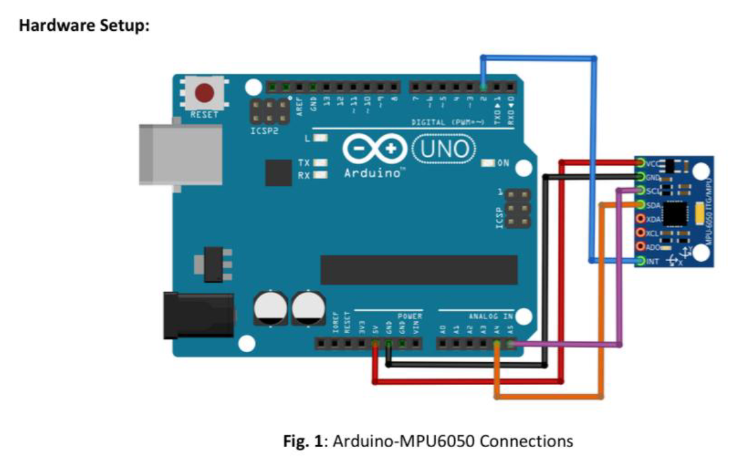
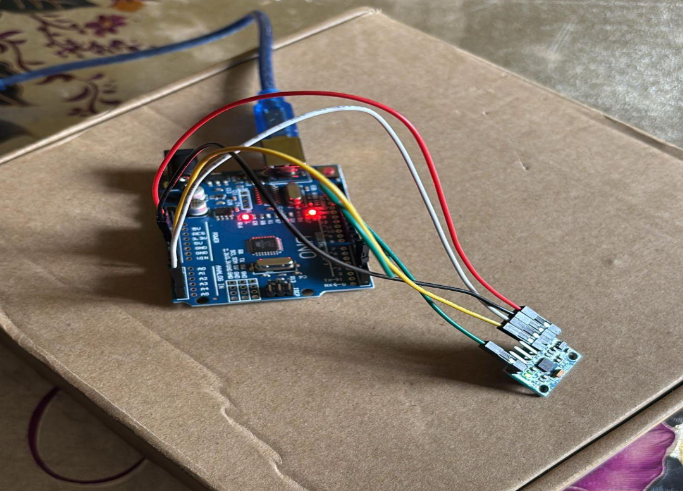
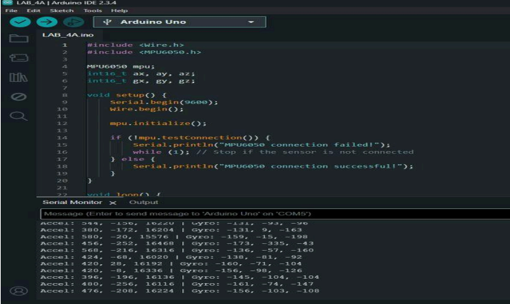
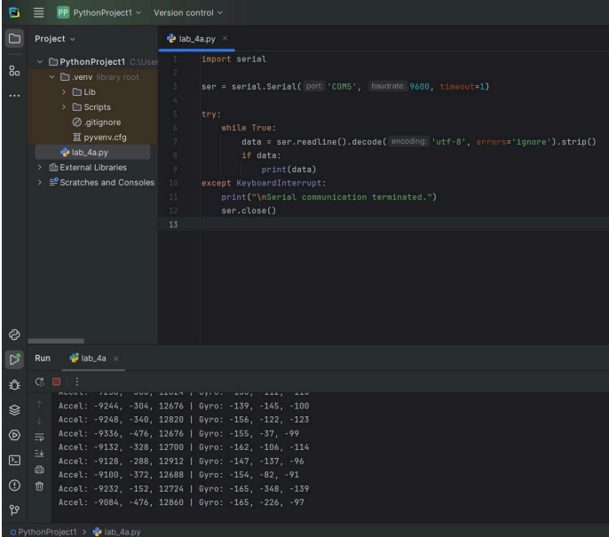

# Lab 3: Serial Communication – Arduino & IMU (MPU6050) Hand Gesture Recognition

## Abstract
This experiment demonstrates serial interfacing between an Arduino and an IMU (MPU6050) to measure hand motion along an XYZ plane. Hand movements were displayed as numerical values on the Arduino Serial Monitor and Python terminal, enabling gesture detection.

## Introduction
The project leverages serial communication to bridge Arduino hardware with Python software. The IMU provides accelerometer and gyroscope data, which is useful for hand gesture recognition. Applications include physiotherapy, robotics, home automation, and human-computer interaction (HCI). The system tracks positive and negative XYZ coordinates of hand motion in real-time.

## Materials and Equipment
- Arduino Uno board  
- MPU6050 sensor  
- Computer with Arduino IDE and Python 3.x installed  
- Jumper wires / Breadboard wires  
- USB cable for Arduino-PC connection  
- LEDs (optional visual indicators)

## Experimental Setup
### Hardware Setup
1. Connect the MPU6050 sensor to Arduino using I2C:  
   - SDA → A4, SCL → A5  
   - VCC → 5V, GND → GND  
2. Connect Arduino to PC via USB.  
3. Optional: Connect LEDs for visual feedback.

### Images
- Layouts:  
    
    
- Results:  
    
    

## Methodology
- Arduino reads accelerometer and gyroscope data using the MPU6050 library.  
- Gesture recognition is performed by threshold comparison of sensor data.  
- Detected gestures are sent via serial to Python, which logs actions.  

### Arduino Code
See full implementation here: [arduino_lab3.ino](arduino_lab3.ino)

### Python Code
See full implementation here: [python_lab3.py](python_lab3.py)

```python
import serial

ser = serial.Serial('COM4', 9600)
while True:
    data = ser.readline().decode('utf-8').strip()
    if data.startswith("Detected Gesture: "):
        gesture = data.split(": ")[1]
        if gesture == "Gesture 1":
            print("Action for Gesture 1")
        elif gesture == "Gesture 2":
            print("Action for Gesture 2")
