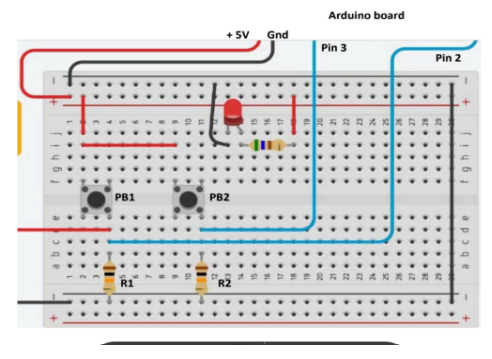
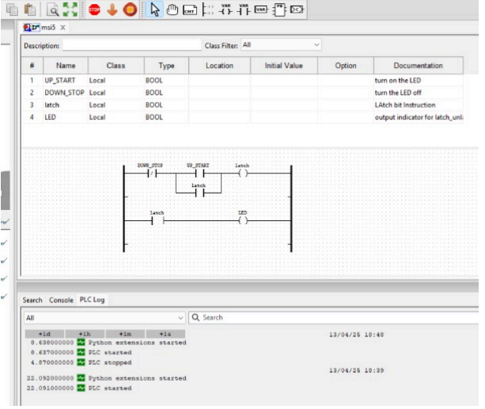

# Lab 4: Arduino + PLC LED Control

## Abstract
Experiment 5 aimed to understand PLC principles using Arduino and OpenPLC Editor. Two push buttons were used to control an LED with ladder logic. Despite setting up the system, the LED lit on its own and did not respond to the buttons.

## Extended Description
This experiment demonstrates Arduino as a PLC platform. OpenPLC Editor allows programming ladder logic, which is then uploaded to the Arduino. Two buttons act as inputs (turn on/off), and an LED is the output. Wiring issues or component faults caused unexpected LED behavior.

## Equipment
- Arduino Board
- OpenPLC Editor software
- 2 Push Button Switches
- Jumper Wires
- LED
- Resistors (10kΩ & 560Ω)
- Breadboard

## Images
- Hardware Layout: 
- Ladder Diagram: 

## Code
- Arduino loader: [arduino_lab4.ino](arduino_lab4.ino)
- OpenPLC program: [lab4_program.st](lab4_program.st)

## Methodology
1. Connect Arduino, buttons, and LED according to layout.
2. Program ladder logic using OpenPLC Editor.
3. Upload ladder program to Arduino via OpenPLC runtime.
4. Test the LED response with push buttons.

## Discussion
The LED did not behave as expected, possibly due to wiring issues or faulty components. Ladder logic worked in simulation but hardware anomalies prevented correct operation.

## Conclusion
This lab demonstrates PLC logic implementation on Arduino, highlighting practical challenges with physical components.

## Recommendations
1. Troubleshoot components and connections before testing.
2. Verify wiring and button operation.
