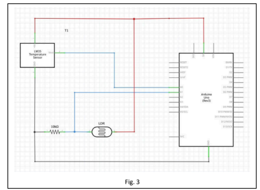

# Lab 5: Arduino DAQ System with PLX-DAQ

## Abstract
This lab explored a basic Data Acquisition (DAQ) system using Arduino and analog sensors (LDR & LM35). Data was meant to be sent to PLX-DAQ for logging and visualization in real-time. However, the experiment failed because PLX-DAQ is incompatible with 64-bit Excel.

## Extended Description
Arduino reads analog inputs from an LDR and LM35 sensor. The readings are sent over serial to PLX-DAQ, which should log them in Excel. This demonstrates basic DAQ principles: converting physical parameters into digital signals for analysis.

## Equipment
- Arduino Board
- PLX-DAQ software
- LDR (Light Dependent Resistor)
- LM35 Temperature Sensor
- Jumper Wires
- Resistor (10kΩ)
- Breadboard

## Image

## Code
- Arduino DAQ code: [arduino_lab5.ino](arduino_lab5.ino)

## Methodology
1. Connect LDR and LM35 to Arduino analog pins.
2. Connect Arduino to computer and select correct COM port in PLX-DAQ.
3. Run Arduino code to transmit sensor readings via serial.
4. PLX-DAQ reads serial data and logs into Excel tables.

## Discussion
Experiment failed due to PLX-DAQ crashing on 64-bit Excel. Theoretically, LDR and LM35 readings would be digitized and logged in real-time for analysis.

## Conclusion
DAQ system couldn’t be tested due to software incompatibility. Understanding DAQ principles remains valuable for sensor-based data logging and analysis.

## Recommendations
1. Upgrade PLX-DAQ to a version compatible with 64-bit Excel.
