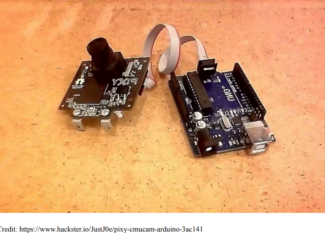
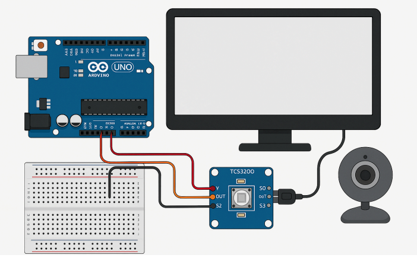
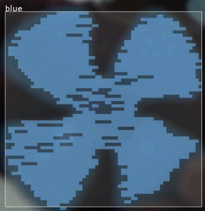
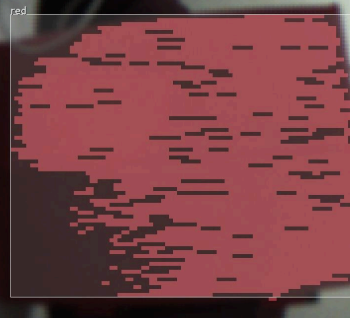
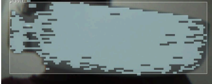

# Lab 7: Color Detection with Arduino & Python

## Abstract
**Part 1:** Using TCS230/TCS34725 color sensor to detect colors via Arduino and Python serial communication.  
**Part 2:** Using Pixy1 camera with Arduino to detect colors (red, green, blue) and display x-y coordinates of detected objects.

## Equipment
- Arduino Board
- TCS230/TCS34725 Sensor (Part 1)
- Pixy1 Camera (Part 2)
- Jumper Wires, Breadboard, USB cable
- Python & Arduino IDE installed on PC

## Images
- Setup Part 1: 
- Setup Part 2: 

## Output Results
- 
- 
- 

## Methodology
**Part 1:**  
1. Connect color sensor to Arduino.  
2. Upload Arduino code.  
3. Python script reads serial data and interprets dominant color.

**Part 2:**  
1. Connect Pixy1 camera to Arduino.  
2. Assign signatures for red, green, blue.  
3. Upload Arduino code to read Pixy1 data.  
4. Serial monitor displays object coordinates and color detected.
## Code Files

**Part 1 (Color Sensor TCS230/TCS34725):**  
- `arduino_lab7_part1.ino` – Arduino code to read RGB values from the sensor  
- `python_lab7_part1.py` – Python code to read serial data from Arduino and identify colors

**Part 2 (Pixy1 Camera):**  
- `arduino_lab7_part2.ino` – Arduino code to interface with Pixy1 camera and display detected colors on the Serial Monitor

## Discussion
- **Part 1:** Sensor failed to communicate reliably. Errors prevented Arduino-Python communication.  
- **Part 2:** Pixy1 successfully detected red, green, blue objects and reported x-y coordinates. Camera quality limited clarity.

## Conclusion
- Part 1 unsuccessful due to sensor issues.  
- Part 2 successful; Pixy1 detected colors and displayed coordinates accurately.

## Recommendations
1. Replace faulty sensor hardware.  
2. Use higher-quality camera for clearer image capture.
