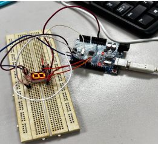

# 7-Segment Display Counter (0–5)

## Abstract
This experiment aimed to apply basic digital logic design by implementing a 7-segment display controlled by a push button using an Arduino. The system was expected to display numbers from 0 to 5 sequentially. However, while the display responded to input, the LEDs lit up in random patterns instead of forming the correct numbers, possibly due to faulty components.


## Circuit Setup


---

## Introduction
This project explores the fundamentals of digital logic design using a 7-segment display. A 7-segment display consists of seven LEDs that can be individually controlled to represent numbers from 0 to 9.

Each segment operates on binary logic:
- HIGH (1) → LED ON  
- LOW (0) → LED OFF  

By controlling combinations of these segments, different numbers can be displayed. The system uses a push button to trigger counting from 0 to 5 with a delay.

---

## Equipment
- Arduino Uno
- Common cathode 7-segment display
- 220-ohm resistors (7 units)
- Push buttons
- Jumper wires
- Breadboard

---

## Circuit Setup
- Connect segments (A–G) to Arduino digital pins
- Connect common cathode to GND
- Use 220-ohm resistors for each segment
- Connect push button to digital input pin
- Use pull-up resistor configuration

---

## Methodology
1. Build the circuit on a breadboard
2. Upload Arduino code
3. Press push button to trigger counting
4. Observe LED behavior on the 7-segment display

---

## Results
- All segments initially lit up correctly
- When button was pressed, display responded
- However, LEDs lit in random patterns instead of showing numbers 0–5

---

## Discussion
The expected output was not achieved. Possible reasons include:
- Faulty or damaged components
- Incorrect signal mapping
- Wiring inconsistencies

This shows the importance of proper debugging and hardware validation in embedded systems.

---

## Conclusion
This experiment demonstrated the basic operation of a 7-segment display using Arduino. Although the intended output was not fully achieved, the project provided valuable insights into digital logic control, wiring, and troubleshooting.

---

## Recommendations
- Use verified components to avoid faulty outputs
- Improve wiring stability
- Implement continuous counting (start/stop button)
- Optimize resistor values for brightness and efficiency

---

## References
- https://projecthub.arduino.cc/stannano/one-digit-7-segment-led-display-819bcd  
- https://www.instructables.com/Using-a-4-digit-7-scgment-display-with-arduino/

---

## Code
```cpp
// Define segment pins
const int segmentA = 2;
const int segmentB = 3;
const int segmentC = 4;
const int segmentD = 5;
const int segmentE = 6;
const int segmentF = 7;
const int segmentG = 8;

const int PB = 10;

void setup() {
  pinMode(PB, INPUT);
  pinMode(segmentA, OUTPUT);
  pinMode(segmentB, OUTPUT);
  pinMode(segmentC, OUTPUT);
  pinMode(segmentD, OUTPUT);
  pinMode(segmentE, OUTPUT);
  pinMode(segmentF, OUTPUT);
  pinMode(segmentG, OUTPUT);
}

void loop() {
  int x = digitalRead(PB);

  if (x == 1) {
    // Example: Display 0
    digitalWrite(segmentA, HIGH);
    digitalWrite(segmentB, HIGH);
    digitalWrite(segmentC, HIGH);
    digitalWrite(segmentD, HIGH);
    digitalWrite(segmentE, HIGH);
    digitalWrite(segmentF, HIGH);
    delay(500);

    // Turn off
    digitalWrite(segmentA, LOW);
    digitalWrite(segmentB, LOW);
    digitalWrite(segmentC, LOW);
    digitalWrite(segmentD, LOW);
    digitalWrite(segmentE, LOW);
    digitalWrite(segmentF, LOW);
    delay(500);
  }
}
